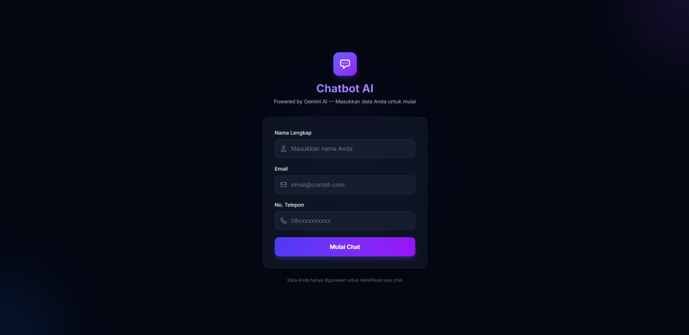
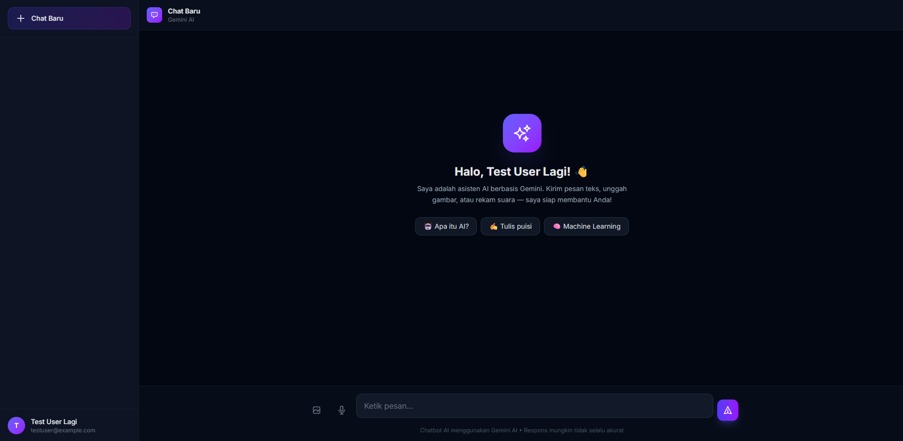

<p align="center">
  
  
  
  
</p>

# 🤖 Chatbot AI — Gemini AI Chatbot

Aplikasi chatbot web responsif yang terintegrasi dengan **Gemini AI** dari Google. Mendukung input **teks**, **gambar**, dan **audio** dengan antarmuka modern dark-mode dan REST API untuk integrasi eksternal.

---

## 📋 Daftar Isi

- [Fitur](#-fitur)
- [Screenshot](#-screenshot)
- [System Requirements](#-system-requirements)
- [Instalasi](#-instalasi)
- [Konfigurasi](#-konfigurasi)
- [Menjalankan Aplikasi](#-menjalankan-aplikasi)
- [Penggunaan Web](#-penggunaan-web)
- [API Reference](#-api-reference)
- [Struktur Proyek](#-struktur-proyek)
- [Troubleshooting](#-troubleshooting)
- [Lisensi](#-lisensi)

---

## ✨ Fitur

| Fitur                     | Deskripsi                                                         |
| ------------------------- | ----------------------------------------------------------------- |
| 💬 **Chat Teks**          | Kirim pesan teks dan dapatkan respons AI secara real-time         |
| 🖼️ **Analisis Gambar**    | Upload gambar untuk dianalisis oleh Gemini AI                     |
| 🎤 **Input Audio**        | Rekam suara langsung dari browser untuk diproses AI               |
| 📜 **Riwayat Chat**       | Simpan dan muat kembali riwayat percakapan                        |
| 🌙 **Dark Mode**          | Antarmuka modern dark-mode dengan glassmorphism                   |
| 📱 **Responsif**          | Tampilan optimal di desktop, tablet, dan mobile                   |
| 🔌 **REST API**           | API lengkap untuk integrasi aplikasi eksternal                    |
| 👤 **Guest Registration** | Registrasi sederhana tanpa login — cukup nama, email, dan telepon |

---

## 📸 Screenshot

### Halaman Registrasi

Pengguna mengisi nama, email, dan nomor telepon untuk memulai sesi chat.

<p align="center">
  
</p>

### Halaman Chat

Antarmuka chat dengan sidebar riwayat percakapan, area pesan, dan input multimodal (teks, gambar, audio).

<p align="center">
  
</p>

---

## 💻 System Requirements

| Komponen     | Minimum                 | Direkomendasikan          |
| ------------ | ----------------------- | ------------------------- |
| **PHP**      | 8.2                     | 8.3+                      |
| **Composer** | 2.x                     | Latest                    |
| **Node.js**  | 18.x                    | 20.x+                     |
| **NPM**      | 9.x                     | 10.x+                     |
| **Database** | SQLite 3                | MySQL 8.0 / PostgreSQL 15 |
| **OS**       | Windows / macOS / Linux | —                         |

### PHP Extensions yang Diperlukan

- `php-mbstring`
- `php-xml`
- `php-curl`
- `php-sqlite3` (atau `php-mysql` / `php-pgsql`)
- `php-fileinfo`
- `php-gd` atau `php-imagick`

### Akun & API Key

- **Gemini AI API Key** — Dapatkan di [Google AI Studio](https://aistudio.google.com/apikey)

---

## 🚀 Instalasi

### 1. Clone Repository

```bash
git clone https://github.com/username/chatbot-ai-app.git
cd chatbot-ai-app
```

### 2. Install Dependencies

```bash
# Install PHP dependencies
composer install

# Install Node.js dependencies
npm install
```

### 3. Konfigurasi Environment

```bash
# Salin file environment
cp .env.example .env

# Generate application key
php artisan key:generate
```

### 4. Setup Database

Secara default, aplikasi menggunakan **SQLite**. File database akan dibuat otomatis.

```bash
# Buat file SQLite (jika belum ada)
touch database/database.sqlite

# Jalankan migrasi
php artisan migrate
```

> **💡 Menggunakan MySQL?** Edit `.env`:
>
> ```env
> DB_CONNECTION=mysql
> DB_HOST=127.0.0.1
> DB_PORT=3306
> DB_DATABASE=chatbot_ai
> DB_USERNAME=root
> DB_PASSWORD=
> ```

### 5. Konfigurasi Gemini AI

Edit file `.env` dan tambahkan API key:

```env
GEMINI_API_KEY=your_gemini_api_key_here
GEMINI_MODEL=gemini-2.5-flash
```

### 6. Setup Storage

```bash
# Buat symbolic link untuk public storage
php artisan storage:link
```

### 7. (Opsional) Jalankan Seeder

```bash
# Seed data contoh (2 guest dengan riwayat chat)
php artisan db:seed
```

### Quick Setup (Satu Perintah)

Alternatif, gunakan script setup bawaan:

```bash
composer run setup
```

Script ini akan menjalankan `composer install`, copy `.env`, `key:generate`, `migrate`, `npm install`, dan `npm run build` secara otomatis.

---

## ⚙️ Konfigurasi

### Environment Variables

| Variable            | Deskripsi                   | Default            |
| ------------------- | --------------------------- | ------------------ |
| `GEMINI_API_KEY`    | API key Gemini AI (wajib)   | —                  |
| `GEMINI_MODEL`      | Model Gemini yang digunakan | `gemini-2.5-flash` |
| `GEMINI_MAX_TOKENS` | Maksimal token respons      | `8192`             |
| `DB_CONNECTION`     | Driver database             | `sqlite`           |
| `SESSION_DRIVER`    | Driver session              | `database`         |
| `QUEUE_CONNECTION`  | Driver queue                | `database`         |

### File Konfigurasi Gemini

Konfigurasi Gemini berada di `config/gemini.php`:

```php
return [
    'api_key'    => env('GEMINI_API_KEY', ''),
    'model'      => env('GEMINI_MODEL', 'gemini-2.5-flash'),
    'max_tokens' => env('GEMINI_MAX_TOKENS', 8192),
];
```

---

## ▶️ Menjalankan Aplikasi

### Mode Development

Gunakan script `dev` untuk menjalankan semua service secara bersamaan:

```bash
composer run dev
```

Perintah ini menjalankan secara paralel:

- **Laravel Server** → `http://localhost:8000`
- **Queue Worker** → Memproses job antrian
- **Vite Dev Server** → Hot Module Replacement untuk frontend

### Mode Manual

```bash
# Terminal 1: Laravel Server
php artisan serve

# Terminal 2: Vite Dev Server
npm run dev

# Terminal 3 (opsional): Queue Worker
php artisan queue:listen --tries=1
```

### Build Production

```bash
npm run build
```

Akses aplikasi di: **http://localhost:8000**

---

## 📖 Penggunaan Web

### 1. Registrasi

1. Buka `http://localhost:8000`
2. Isi form registrasi: **Nama Lengkap**, **Email**, dan **No. Telepon**
3. Klik tombol **"Mulai Chat"**
4. Session token akan disimpan secara otomatis

### 2. Chat Teks

1. Ketik pesan di kolom input di bagian bawah
2. Tekan **Enter** atau klik tombol **Send** (ikon panah)
3. Tunggu respons dari Gemini AI (ditandai dengan animasi typing indicator)

### 3. Upload Gambar

1. Klik ikon **gambar** (📷) di sebelah kiri kolom input
2. Pilih file gambar (max 10MB, format: JPG, PNG, WebP, HEIC)
3. _Opsional:_ Tambahkan deskripsi/prompt di kolom teks
4. Klik **Send** — AI akan menganalisis dan menjelaskan gambar

### 4. Rekam Audio

1. Klik ikon **mikrofon** (🎤)
2. Izinkan akses mikrofon jika diminta browser
3. Rekam pesan suara Anda (ditandai indikator recording merah)
4. Klik ikon mikrofon lagi untuk menghentikan dan mengirim
5. AI akan memproses audio dan memberikan respons

### 5. Kelola Riwayat Chat

- **Chat Baru:** Klik tombol **"+ Chat Baru"** di sidebar
- **Muat Chat:** Klik judul chat di sidebar untuk memuat riwayat
- **Hapus Chat:** Klik ikon **tempat sampah** (🗑) di header chat

---

## 🔌 API Reference

API tersedia di prefix `/api/v1` untuk integrasi aplikasi eksternal. Autentikasi menggunakan **Bearer Token** yang didapat saat registrasi.

### Base URL

```
http://localhost:8000/api/v1
```

### Headers Umum

```
Authorization: Bearer {token}
Accept: application/json
```

---

### 1. Register Guest

Registrasi guest baru dan dapatkan token autentikasi.

```http
POST /api/v1/register
Content-Type: application/json
```

**Body:**

```json
{
    "name": "John Doe",
    "email": "john@example.com",
    "phone": "081234567890"
}
```

**Response** `201 Created`:

```json
{
    "message": "Registrasi berhasil",
    "token": "abc123...xyz789",
    "guest": {
        "id": 1,
        "name": "John Doe",
        "email": "john@example.com"
    }
}
```

---

### 2. Kirim Pesan Teks

```http
POST /api/v1/chat/text
Authorization: Bearer {token}
Content-Type: application/json
```

**Body:**

```json
{
    "message": "Apa itu artificial intelligence?",
    "chat_id": 1
}
```

> `chat_id` opsional. Jika tidak diisi, chat baru akan dibuat otomatis.

**Response** `200 OK`:

```json
{
    "chat_id": 1,
    "chat_title": "Apa itu artificial intelligence?",
    "response": {
        "id": 2,
        "role": "assistant",
        "content": "Artificial Intelligence (AI) adalah...",
        "type": "text",
        "created_at": "2026-03-13T12:00:00.000000Z"
    }
}
```

---

### 3. Kirim Gambar

```http
POST /api/v1/chat/image
Authorization: Bearer {token}
Content-Type: multipart/form-data
```

**Form Data:**
| Field | Type | Required | Deskripsi |
|-------|------|----------|-----------|
| `image` | File | ✅ | File gambar (max 10MB) |
| `prompt` | String | ❌ | Prompt untuk analisis gambar |
| `chat_id` | Integer | ❌ | ID chat yang ada |

**Response** `200 OK`:

```json
{
    "chat_id": 1,
    "chat_title": "📷 Gambar dikirim",
    "response": {
        "id": 4,
        "role": "assistant",
        "content": "Gambar ini menunjukkan...",
        "type": "text",
        "created_at": "2026-03-13T12:05:00.000000Z"
    }
}
```

---

### 4. Kirim Audio

```http
POST /api/v1/chat/audio
Authorization: Bearer {token}
Content-Type: multipart/form-data
```

**Form Data:**
| Field | Type | Required | Deskripsi |
|-------|------|----------|-----------|
| `audio` | File | ✅ | File audio (max 10MB) |
| `chat_id` | Integer | ❌ | ID chat yang ada |

**Response** `200 OK`:

```json
{
    "chat_id": 1,
    "chat_title": "🎤 Pesan suara",
    "response": {
        "id": 6,
        "role": "assistant",
        "content": "Berdasarkan audio Anda...",
        "type": "text",
        "created_at": "2026-03-13T12:10:00.000000Z"
    }
}
```

---

### 5. Buat Chat Baru

```http
POST /api/v1/chat/new
Authorization: Bearer {token}
```

**Response** `201 Created`:

```json
{
    "chat": {
        "id": 2,
        "title": "Chat Baru",
        "created_at": "2026-03-13T12:15:00.000000Z"
    }
}
```

---

### 6. Daftar Semua Chat

```http
GET /api/v1/chats
Authorization: Bearer {token}
```

**Response** `200 OK`:

```json
{
    "chats": [
        {
            "id": 1,
            "title": "Apa itu AI?",
            "created_at": "2026-03-13T12:00:00.000000Z",
            "updated_at": "2026-03-13T12:10:00.000000Z"
        }
    ]
}
```

---

### 7. Riwayat Chat

```http
GET /api/v1/chat/{chat_id}/history
Authorization: Bearer {token}
```

**Response** `200 OK`:

```json
{
    "chat": {
        "id": 1,
        "title": "Apa itu AI?"
    },
    "messages": [
        {
            "id": 1,
            "role": "user",
            "content": "Apa itu AI?",
            "type": "text",
            "file_url": null,
            "created_at": "2026-03-13T12:00:00.000000Z"
        },
        {
            "id": 2,
            "role": "assistant",
            "content": "AI adalah...",
            "type": "text",
            "file_url": null,
            "created_at": "2026-03-13T12:00:01.000000Z"
        }
    ]
}
```

---

### 8. Hapus Chat

```http
DELETE /api/v1/chat/{chat_id}
Authorization: Bearer {token}
```

**Response** `200 OK`:

```json
{
    "message": "Chat berhasil dihapus"
}
```

---

### Error Responses

| Status Code                 | Deskripsi                                 |
| --------------------------- | ----------------------------------------- |
| `401 Unauthorized`          | Token tidak valid atau tidak disertakan   |
| `403 Forbidden`             | Akses ditolak (chat milik user lain)      |
| `422 Unprocessable Entity`  | Validasi input gagal                      |
| `500 Internal Server Error` | Error sisi server (Gemini API gagal, dll) |

**Contoh Error:**

```json
{
    "error": "Gagal mendapatkan respons dari AI. Silakan coba lagi."
}
```

---

## 📁 Struktur Proyek

```
chatbot-ai-app/
├── app/
│   ├── Http/Controllers/
│   │   ├── ChatController.php         # Controller web (session-based)
│   │   └── Api/
│   │       └── ChatApiController.php  # Controller REST API (Bearer token)
│   ├── Models/
│   │   ├── Guest.php                  # Model guest/pengguna
│   │   ├── Chat.php                   # Model sesi chat
│   │   └── Message.php                # Model pesan
│   └── Services/
│       └── GeminiService.php          # Integrasi Gemini AI API
├── config/
│   └── gemini.php                     # Konfigurasi Gemini
├── database/
│   ├── migrations/
│   │   ├── create_guests_table.php
│   │   ├── create_chats_table.php
│   │   └── create_messages_table.php
│   └── seeders/
│       └── GuestSeeder.php            # Data contoh
├── resources/
│   ├── views/
│   │   ├── layouts/app.blade.php      # Layout utama
│   │   ├── register.blade.php         # Halaman registrasi
│   │   └── chat.blade.php             # Halaman chat
│   ├── js/
│   │   ├── app.js                     # Entry point
│   │   ├── bootstrap.js               # Axios setup
│   │   └── chat.js                    # Logika chat (text, image, audio)
│   └── css/
│       └── app.css                    # Stylesheet (TailwindCSS)
├── routes/
│   ├── web.php                        # Routes web
│   └── api.php                        # Routes API v1
├── .env.example                       # Template environment
├── composer.json                      # PHP dependencies
├── package.json                       # Node.js dependencies
└── vite.config.js                     # Vite + TailwindCSS config
```

---

## 🔧 Troubleshooting

### "Gemini API key is not configured"

Pastikan variabel `GEMINI_API_KEY` sudah diset di file `.env`:

```env
GEMINI_API_KEY=AIzaSy...
```

Kemudian clear config cache:

```bash
php artisan config:clear
```

### "Gagal mendapatkan respons dari AI"

1. Periksa API key masih valid di [Google AI Studio](https://aistudio.google.com/apikey)
2. Periksa koneksi internet
3. Periksa log di `storage/logs/laravel.log`

### Gambar tidak muncul setelah upload

Pastikan symbolic link storage sudah dibuat:

```bash
php artisan storage:link
```

### Error "CSRF token mismatch"

Clear cache dan session:

```bash
php artisan cache:clear
php artisan config:clear
```

### Vite manifest not found

Build ulang assets:

```bash
npm run build
```

---

## 📄 Lisensi

Proyek ini menggunakan lisensi [MIT](LICENSE).

---

<p align="center">
  Dibuat dengan sadar menggunakan <strong>Laravel 12</strong>
</p>
